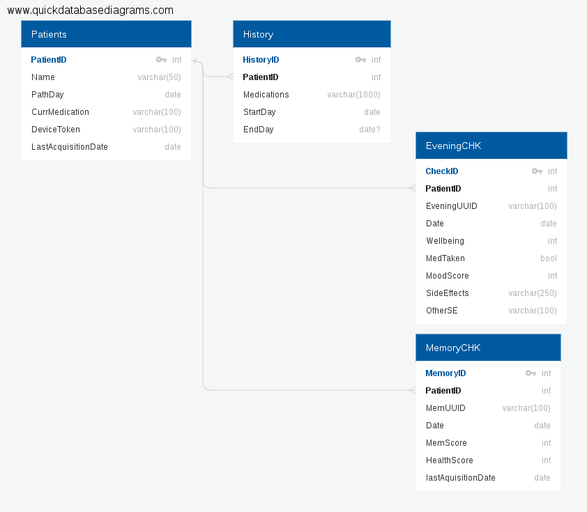

# CTRL-Group-Challenge

### The challenge is described [here](./Pathway_app_API_Challenge.pdf).

Briefly:

Build a Back-end that can deal with
>clients that send data intermittently over long periods
of time, and may or may not be offline when used.

And that helps on this front too:
>Furthermore, the server stores entities in
highly generic form, so a lot of the client-side API interaction code deals with shoehorning local data into an acceptable format.

I will try to do this using Node.js and PostgreSQL database.

The first solution that came to my mind was to use [Socket.io](https://socket.io/),
which allow real time bi-directional communications between devices.

It could be a viable solution, but I thought that a better way to reach the goal is to use Push Notifications. Namely APNs (Apple Push Notification service).

Usually this system is used to deliver content from a provider to apple devices (and their users), but according to [this IBM source](https://www.ibm.com/support/knowledgecenter/en/SSYRPW_9.0.1/APNS.html):
>Based on the device configuration, APNS messages can cause the device to change the app badge count, show an alert, and so on. [...], __APNS messages can also cause the app to sync in the background__.

Here we could use this feature to our advantage.

In order to leverage APNs operations in Node.js the [apns module](https://www.npmjs.com/package/apns) will be used.

First a little introduction to how I think the database should store the relevant information.

The database diagram:

Bonus: The database [SQL file](./QuickDBD-P_diagram.sql) and [documentation](./QuickDBD-P_diagram.pdf).

The functions described in [nodeServer.js](./nodeServer.js) are an INCOMPLETE example of the code of the main parts of the concept.

They use... well, APNs, [Moment.js](http://momentjs.com/) and node's [cron](https://www.npmjs.com/package/cron).

They do the assembly of the payload and the connection to APNs for each user device stored in the database and send notifications every 12 hours.
The time frame is not a problem as every notification will contain the list missing samples and it will supersede the previous one.
The custom payload will contain an array of days to collect and the badge count will represent the number of days missing. Its main purpose is to give the notification high priority, but it could possibly help in case of partial submssion of the dataset.

Obviously the whole solution is based on the assumption that on the remote device (phone) _the data will be stored in with a sytem that grants unicity of the sample_.

A way of achieving unicity is using [UUIDs](http://www.ietf.org/rfc/rfc4122.txt). Each sampling could be stored using encoded uuidv5.
This version allows to encode UUID from arbitrary strings, such as the PatientID, the apple device token and the date of acquisition.

When on line and upon verification of the dates the remote device sends back the requested data to the server.

On the server endpoint front (where the remote devices get routed to posting the collected data to the database) the lastAcquisition field gets updated on successful transmission of data and the relative fields of the EveningCHK and ForthnighCHK will be update only when there is no other entry with the same UUID.
This can be easily controlled with the PostgresSQL 'ON CONFLICT DO NOTHING' feature.
This will avoid duplication and grant data
>retention and validity on the server [...].

This concept has the advantage of using the reliable Apple infrastructure.

I included also a little test of the function that generates the array of missing dates. Using tape + tap-spec.

On a side note, an elegant example of an alternative sytem is represented by [IBM's Loopback](https://strongloop.com/strongblog/node-js-api-offline-sync-replication/), only available for client side Angularjs and JavaScript web apps.
