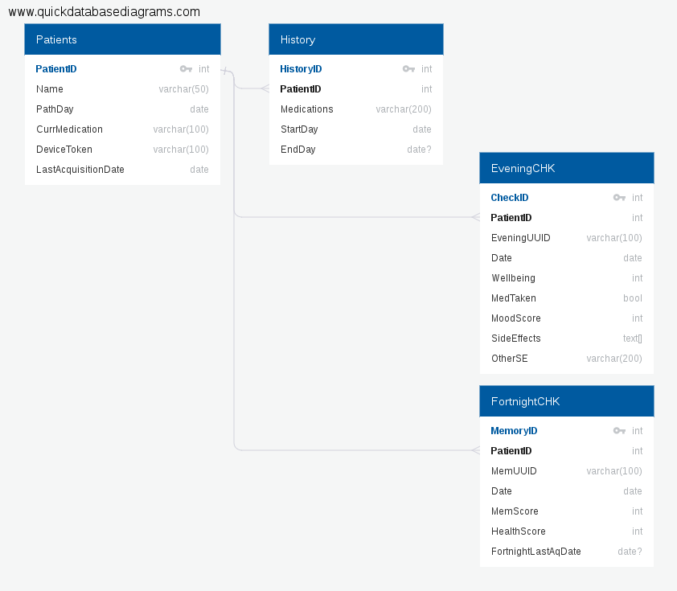

# CTRL-Group-Challenge

#### This repo was created using the CLI and the GitHub API:

`curl -u 'antoniotrkdz' https://api.github.com/user/repos -d '{name:CTRL-Group-Challenge}'`

### The challenge is described [here](./Pathway_app_API_Challenge.pdf).

Briefly:

Build a Back-end that can deal with
>clients that send data intermittently over long periods
of time, and may or may not be offline when used.

And that helps on this front too:
>Furthermore, the server stores entities in
highly generic form, so a lot of the client-side API interaction code deals with shoehorning local data into an acceptable format.

I will try to do this using Node.js and PostgreSQL database.

The first solution that came to my mind was to use [Socket.io](https://socket.io/),
which allow real time bi-directional communications between devices.

It could be a viable solution, but I thought that a better way to reach the goal is to use Push Notifications. Namely APNs (Apple Push Notification service).

Usually this system is used to deliver content from a provider to apple devices (and their users), but according to [this IBM source](https://www.ibm.com/support/knowledgecenter/en/SSYRPW_9.0.1/APNS.html).
>Based on the device configuration, APNS messages can cause the device to change the app badge count, show an alert, and so on. [...], __APNS messages can also cause the app to sync in the background__.

Here we could use this feature to our advantage.

Ino order to simplify APNs operations in Node.js the [apns module](https://www.npmjs.com/package/apns) can be used.

First a little introduction to how I think the database should store the relevant information.

The database diagram: .
Bonus: The database [SQL file](./QuickDBD-P_diagram.sql) and [documentation](./QuickDBD-P_diagram.pdf).

The main feature is that each data acquisition should be receiving an UUID encoded from the dates missing from the lastAcquisition (also stored tin the database) to the date the main function runs and the unique apple device token.
In this way each acqusition is unique per device per day.

The main function described in [nodeServer.js](./nodeServer.js) is a PSEUDOCODE (or incomplete/untested code) of the main parts of the concept.

It does the assembly of the payload and the connection to APNs for each user device stored in the database, daily.
The badge count will represent the number of days missing and the payload will contain an array of days to collect.

Obviously the whole solution is based on the assumption that on the remote device (phone) _the data will be stored in the same way to the local storage_ - the uuid encoded should be the same there.

When on line and upon verification of the UUIDs the remote device sends back the requested data to the server.

The [file](./nodeServer.js) includes also the code that will take care of the endpoint that remote devices reach on posting the collected data.
the lastAcquisition field and the relative fields will be update only when there is no othe entry with the same UUID. This will grant data
>retention and validity on the server [...].
